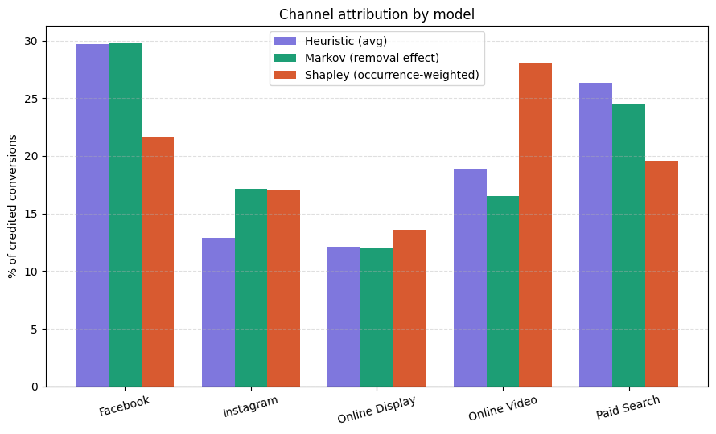
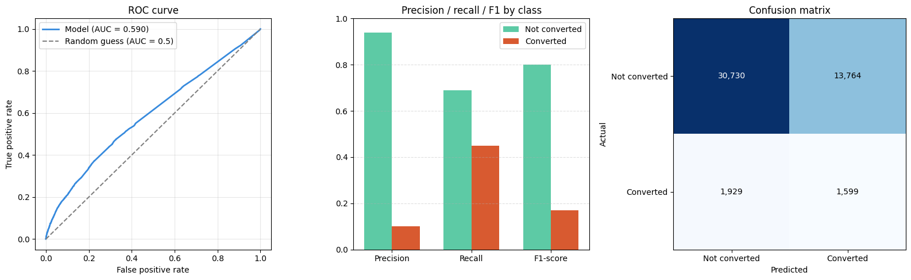

# Multi-Touch Attribution (MTA) Model Comparison

A from-scratch comparison of four attribution approaches — rule-based heuristics,
a Markov chain removal-effect model, an occurrence-weighted Shapley value model,
and a logistic regression model — run on the same real-world touchpoint dataset,
with an honest look at where each method agrees, disagrees, and breaks down.

## Dataset

[`attribution_data.csv`](https://github.com/AjNavneet/MultiTouch-Attribution-Marketing-Spend-Optimization)
— 586,737 touchpoint rows, 240,108 users, 5 channels: Facebook, Instagram,
Online Display, Online Video, Paid Search. Each row is a single impression or
conversion event tied to a user (`cookie`), with a timestamp and channel.

- Users: 240,108
- Conversions: 17,639
- Conversion rate: **7.35%**

## Project structure

```
mta-model/
├── mta_analysis.ipynb      # full analysis: data prep, all four models, charts
├── assets/
│   ├── channel_attribution_comparison.png
│   └── ml_model_diagnostics.png
└── README.md
```

## Running it

This project is a single Google Colab / Jupyter notebook —
`mta_analysis.ipynb` — rather than a package. To run it:

1. Open `mta_analysis.ipynb` in [Google Colab](https://colab.research.google.com/)
   (or Jupyter locally).
2. Upload `attribution_data.csv`
   ([source](https://github.com/AjNavneet/MultiTouch-Attribution-Marketing-Spend-Optimization))
   when prompted in the first cell.
3. Run all cells top to bottom. Each section builds on variables defined in
   the previous one (data loading → journey construction → heuristics →
   Markov chain → Shapley → logistic regression → charts).

Dependencies: `pandas`, `numpy`, `scikit-learn`, `matplotlib` — all
pre-installed in Colab by default.

## Methodology

1. **Journey construction**: touchpoint rows are grouped by `cookie`, sorted
   by time, and collapsed into an ordered channel path per user, with a
   `converted` flag (0/1).
2. **Heuristic models**: standard position-based weighting rules, run on
   converting paths only.
3. **Markov chain**: paths are modeled as transitions between channel states
   (plus `Start`, `Conversion`, `Null` absorbing states). Each channel's
   credit is its *removal effect* — how much the modeled conversion
   probability drops when that channel's transitions are redirected to
   `Null`.
4. **Shapley value**: each journey is reduced to the *set* of unique channels
   touched (order-agnostic). Channel credit is the average marginal
   contribution to conversion rate across every possible channel-subset
   ordering, weighted by how often each subset actually occurs in the data
   (see **Findings** for why the unweighted version is unreliable).
5. **Logistic regression**: journeys are converted to feature vectors (touch
   counts, presence flags, first/last-touch channel identity, path length)
   and used to predict conversion. Channel importance is read from the
   fitted coefficients.

## Results

### Heuristic models (% of credited conversions, converting paths only)

| Channel | First Touch | Last Touch | Linear | U-Shaped | Time Decay |
|---|---|---|---|---|---|
| Facebook | 29.3 | 30.1 | 29.6 | 29.6 | 29.8 |
| Paid Search | 27.0 | 25.8 | 26.5 | 26.4 | 26.1 |
| Online Video | 18.2 | 19.3 | 19.0 | 18.8 | 19.2 |
| Instagram | 13.2 | 12.7 | 12.8 | 12.9 | 12.8 |
| Online Display | 12.2 | 12.1 | 12.0 | 12.1 | 12.1 |

### Markov chain (removal effect)

Baseline conversion probability: **0.0735**

| Channel | Removal effect | Credited conversions | % |
|---|---|---|---|
| Facebook | 0.4139 | 5,253.5 | 29.8 |
| Paid Search | 0.3414 | 4,332.8 | 24.6 |
| Instagram | 0.2382 | 3,023.1 | 17.1 |
| Online Video | 0.2294 | 2,911.4 | 16.5 |
| Online Display | 0.1669 | 2,118.2 | 12.0 |

### Shapley value (occurrence-weighted)

| Channel | Raw value | % |
|---|---|---|
| Online Video | 0.0565 | 28.1 |
| Facebook | 0.0434 | 21.6 |
| Paid Search | 0.0395 | 19.6 |
| Instagram | 0.0341 | 17.0 |
| Online Display | 0.0274 | 13.6 |



### Logistic regression

Test AUC: **0.590** (barely above 0.5 random chance)

| | Precision | Recall | F1 |
|---|---|---|---|
| Not converted | 0.94 | 0.69 | 0.80 |
| Converted | 0.10 | 0.45 | 0.17 |



## Findings

### Facebook is the one channel every method agrees on

All four approaches — heuristics, Markov, and Shapley — put Facebook at
roughly 22–30%, consistently the top or near-top credited channel. That
kind of cross-method agreement is itself a useful signal: it's not an
artifact of any one model's assumptions.

### Instagram: heuristics undercredit it, Markov and Shapley agree it deserves more

Heuristics put Instagram at ~13%. Both Markov (17.1%) and the
occurrence-weighted Shapley (17.0%) — two independent methods with very
different math — land on almost the same higher number. The likely
mechanism: Instagram frequently co-occurs with Facebook on converting
paths, so it's structurally embedded in high-converting journeys even when
it's rarely the first or last touch a simple heuristic would credit.

### Online Video is the biggest disagreement across methods

Heuristics (~19%) and Markov (16.5%) roughly agree, but Shapley puts Online
Video meaningfully higher, at **28.1%** — the single largest gap in the
whole comparison. Shapley measures whether adding a channel to *any*
combination of others tends to raise conversion rate, regardless of
sequence position; Online Video scoring high there suggests it lifts
conversion rate fairly consistently across many different channel mixes,
which a sequence-based method like Markov doesn't weight the same way.

**This is a hypothesis, not a causal finding.** All three methods describe
association in historical data — none of them ran an experiment. The
Online Video and Instagram results are both good candidates for an
incrementality test (a holdout or geo-split experiment) before they inform
real budget decisions, since the same pattern could reflect selection
effects (e.g., users who see Online Video ads were already more likely to
convert) rather than a true causal lift.

### The naive Shapley implementation has a real, documented bug

An earlier equal-weighted Shapley calculation produced a **negative**
attribution value for Paid Search on a smaller sample — implying it hurt
conversions. Diagnosis showed Paid Search's actual effect is genuinely
mixed (positive paired with Facebook or Display, negative paired with
Video or Instagram), but the naive calculation weights every subset size
equally regardless of how often it's observed, letting sparse, rarely-seen
channel combinations drag the aggregate negative. The notebook's Shapley
section instead weights each marginal contribution by how often that
subset actually occurs in the data, which fixes this — the results above
use that occurrence-weighted version.

### The ML model plateaus at AUC ≈ 0.59, and that's a real, important result

Two feature sets were tried — raw touch counts, then a richer set with
presence flags, first/last-touch identity, and path length — and both
plateaued at the same AUC. The ROC curve barely lifts off the random-guess
diagonal, and the confusion matrix shows why: 13,764 false positives
against only 1,599 true positives. Adding much richer features and seeing
*no* improvement is itself informative — it suggests individual-level
conversion is close to structurally unpredictable from channel touches
alone in this dataset.

This surfaces a useful general distinction: **a channel can show a
consistent, real aggregate association (as Markov and Shapley found for
Instagram and Online Video) even when the same data can't predict any
individual's conversion well.** Aggregate attribution and individual-level
prediction are different statistical questions, and this dataset separates
them cleanly.

## Limitations

- **All four methods are observational.** None of them establishes what
  would happen if budget were actually reallocated. Only a controlled
  incrementality experiment (holdout markets, spend pulses) can test that.
- **Identity resolution isn't in scope here.** The `cookie` field is treated
  as ground truth for "one user." In production, that identity is itself
  the product of imperfect deterministic/probabilistic matching (e.g. via
  Adobe Experience Platform, LiveRamp, or similar identity graphs), which
  introduces its own error before attribution modeling even begins.

## Possible next steps

- Restrict the ML model to non-cold journeys (≥1 touchpoint before
  conversion) and see if AUC improves.
- Try a sequence model (e.g. an LSTM over the ordered path) to see if
  capturing order moves the needle beyond logistic regression.
- Design an incrementality test (holdout or geo-split) for Online Video
  and/or Instagram before using these findings to inform real budget
  decisions.
